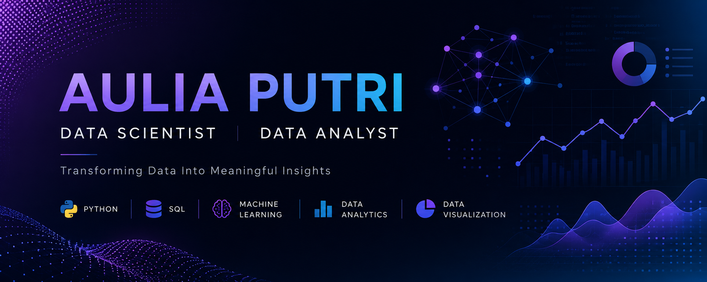

# 👋 Hello, I'm Aulia Putri

Computer Science graduate with strong interest in **Data Science, Data Analytics, and Machine Learning**. I enjoy turning raw data into meaningful insights through analysis, visualization, and predictive modeling.

---

## 🚀 About Me

- 🌱 Currently learning: **Data Engineering, MLOps, Advanced Machine Learning**
- 📊 Interests: Data Analytics, Machine Learning, Business Intelligence, Customer Analytics, Financial Data
- ⚙️ Focus: Building data-driven solutions using Python, SQL, and modern data tools
- 🤝 Open to collaboration in Data Science & Analytics projects

---

## 🛠 Tech Stack

### 💻 Programming Languages

---

### 📊 Data Analysis & Visualization

---

### 🤖 Machine Learning & AI

---

### ✨ Generative AI & LLMs

---

### ⚙️ Data Engineering & Tools

---

## 📌 Skills Summary

- Data Analysis (EDA, Statistical Analysis)
- Data Visualization & Dashboarding
- Machine Learning (Classification, Regression, Clustering)
- Feature Engineering & Model Evaluation
- ETL Pipeline Development
- Workflow Automation (Airflow)

---

## 📈 GitHub Stats

  
  

---

## 🎓 Education

**🎓 Hacktiv8 Data Science Program**  
Focus: Python, SQL, Machine Learning, Data Wrangling, EDA, Deployment

**🎓 Universitas Bina Bangsa**  
Bachelor of Computer Science (2021 - 2025)

---

## 📫 Connect With Me

---

## ✨ Philosophy

> Turning raw data into meaningful insights through analysis, technology, and innovation.